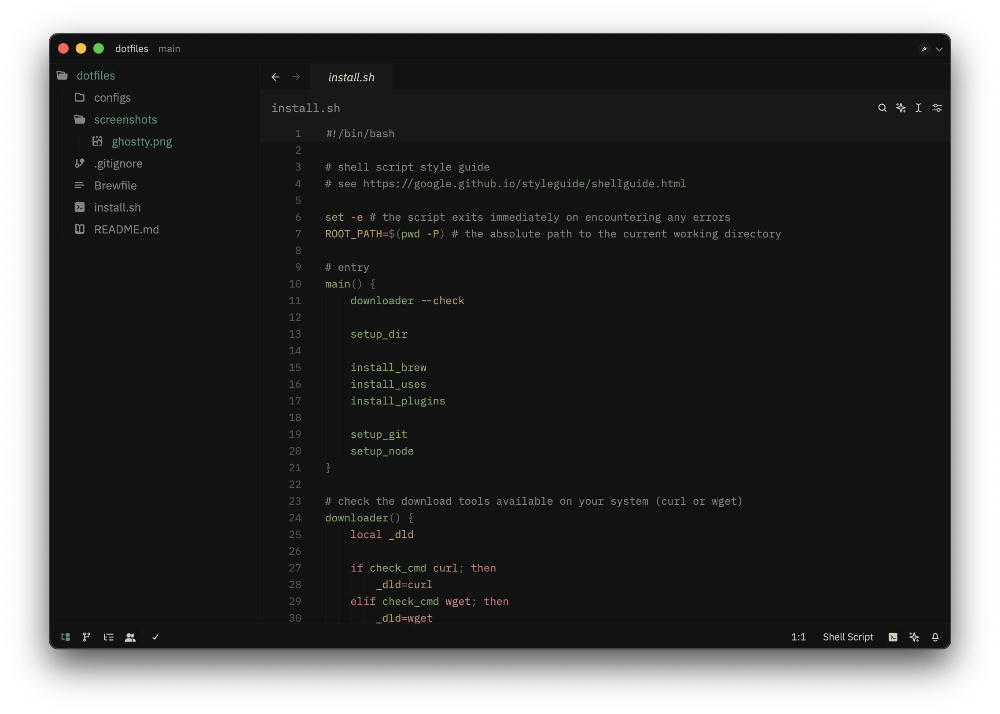
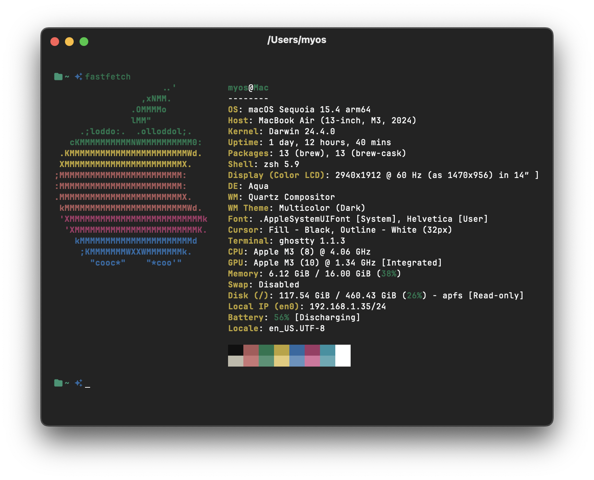

# dotfiles


## Screenshots

| <samp>zed</samp>               | <samp>ghostty</samp>               |
| --------------------------------- | --------------------------------- |
|  |  |

## Usage

```sh
# clone repo
git clone https://github.com/Myoschen/dotfiles.git

# change current directory to the repo
cd dotfiles/

# execute install.sh to setup
sh install.sh
```

## More Tools

- <samp><a href="https://openai.com/chatgpt/">chatgpt</a></samp>
- <samp><a href="https://anytype.io/">anytype</a></samp>
- <samp><a href="https://www.postman.com/">postman</a></samp>
- <samp><a href="https://www.figma.com/">figma</a></samp>
- <samp><a href="https://www.raycast.com/">raycast</a></samp>
- <samp><a href="https://rectangleapp.com/">rectangle</a></samp>
- <samp><a href="https://github.com/jordanbaird/Ice">ice</a></samp>

## Acknowledgments

- [antfu/dotfiles](https://github.com/antfu/dotfiles)
- [dt665m/dotfiles](https://github.com/dt665m/dotfiles)
