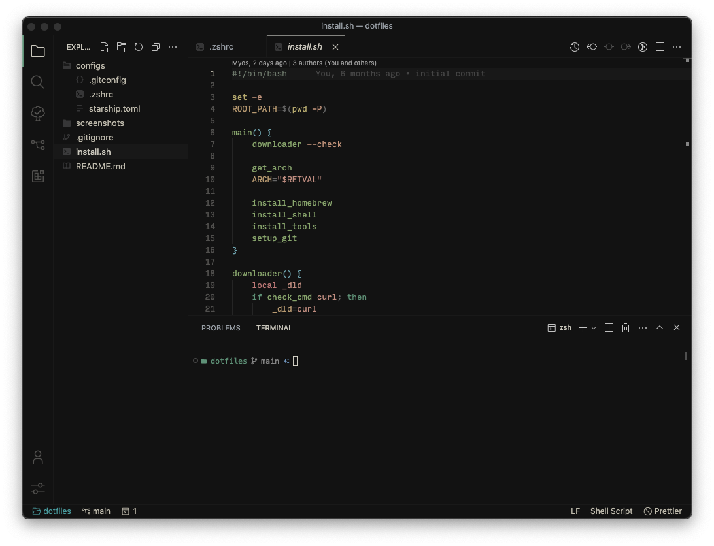
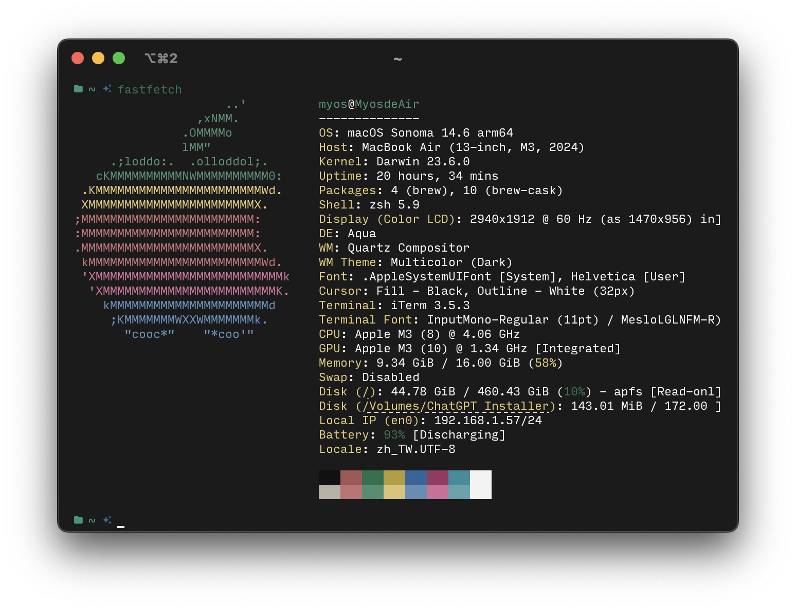

# Myoschen/dotfiles


## Screenshots

| vscode                            | iterm2                            |
| --------------------------------- | --------------------------------- |
|  |  |

## Tools

- [Homebrew](https://brew.sh/)
- [Git](https://git-scm.com/)
- [Firefox](https://www.mozilla.org/en-US/firefox/new/)
- [iterm2](https://iterm2.com/)
- [Visual Studio Code](https://code.visualstudio.com/)
- [Postman](https://www.postman.com/)
- [Figma](https://www.figma.com/)

## Themes

- vscode

  - Font: [Input Mono](https://input.djr.com/)
  - Color Theme: [Vitsse Theme](https://github.com/antfu/vscode-theme-vitesse)
  - Product Icon Theme: [Carbon Icons](https://github.com/antfu/vscode-icons-carbon)
  - File Icon Theme: [Quill Icons](https://github.com/cdonohue/vscode-quill-icons)

- iterm2
  - Theme: [Vitsse Theme](https://github.com/2nthony/vitesse.iterm)
  - Config:
    - Appearance
      - General -> `Theme: Minimal`
      - Panes -> `Side margins: 16`, `Top & Bottom margins: 4`

## Usage

```sh
# clone repo
git clone git@github.com:Myoschen/dotfiles.git

# change current directory to the repo
cd dotfiles/

# execute install.sh to setup
sh install.sh
```

## Acknowledgments

- [antfu/dotfiles](https://github.com/antfu/dotfiles)
- [dt665m/dotfiles](https://github.com/dt665m/dotfiles)
- [Bash Scripting Tutorial – Linux Shell Script and Command Line for Beginners](https://www.freecodecamp.org/news/bash-scripting-tutorial-linux-shell-script-and-command-line-for-beginners/)
